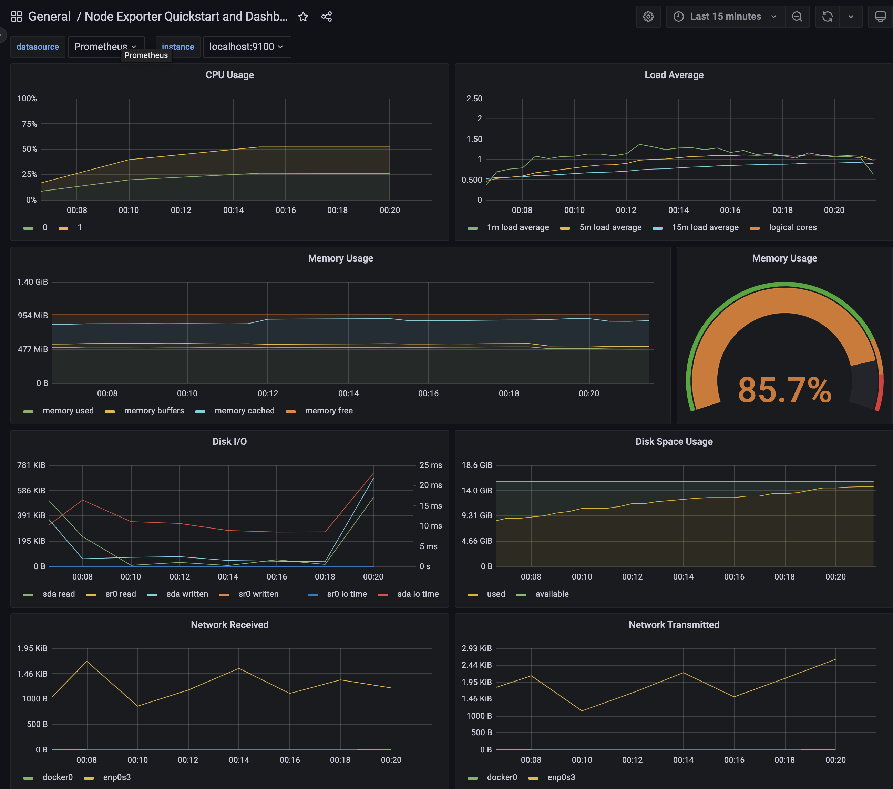
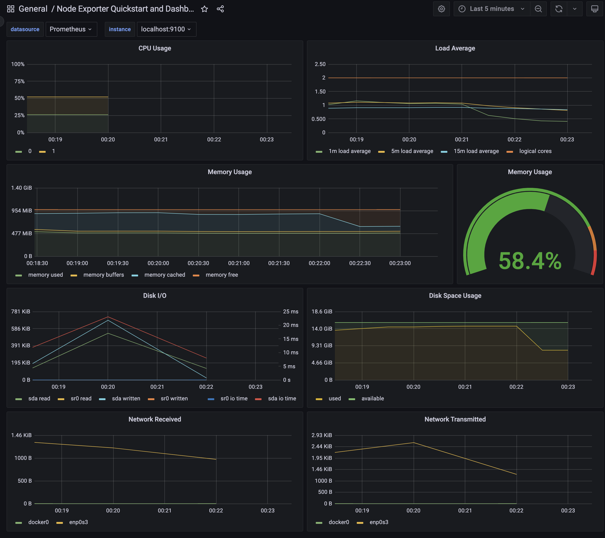
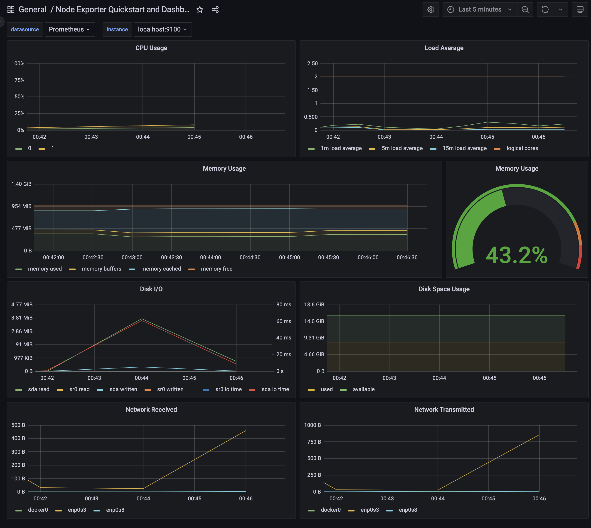

## Part 8. Готовый дашборд

В готовом дащборде *Node Exporter Quickstart and Dashboard* запускаем скрипт из 2 части

     

Удаляем результат работы скрипта из второй части и запускаем утилиту **stress** командой `stress -c 2 -i 1 -m 1 --vm-bytes 32M -t 10s`

После тест нагрузки с помощью утилиты **iperf3**

