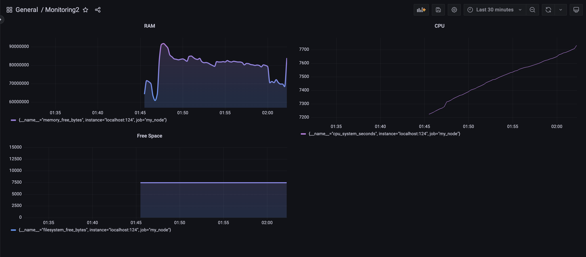

## Part 9. Дополнительно. Свой *node_exporter*

**Grafana** с моими метриками
        

После запуска скрипта из 2 части
        

После запуска утилиты **stress** командой `stress -c 2 -i 1 -m 1 --vm-bytes 32M -t 10s`
        